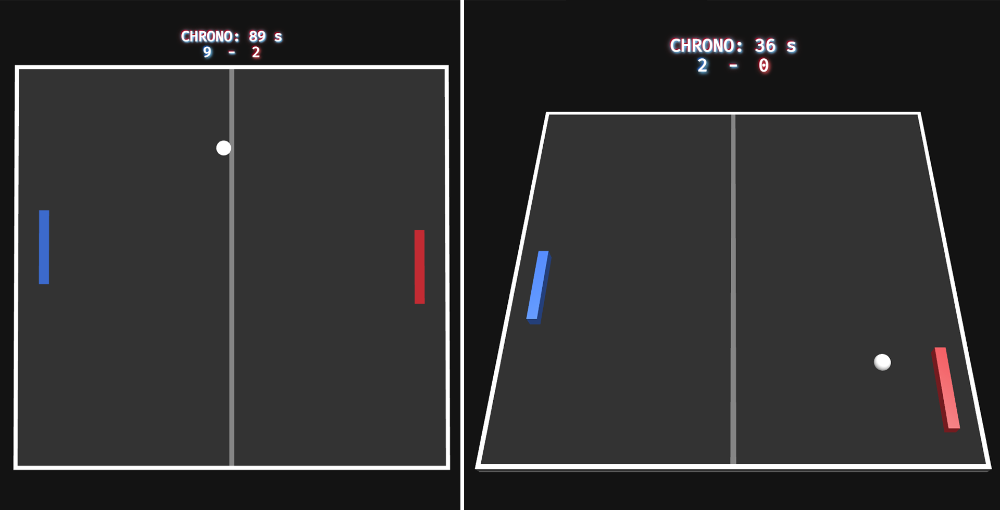
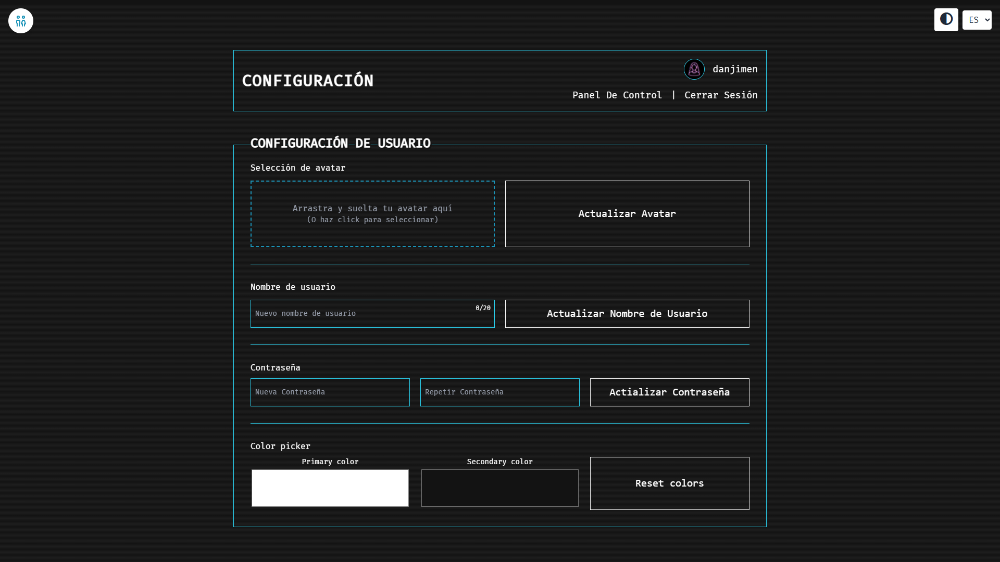
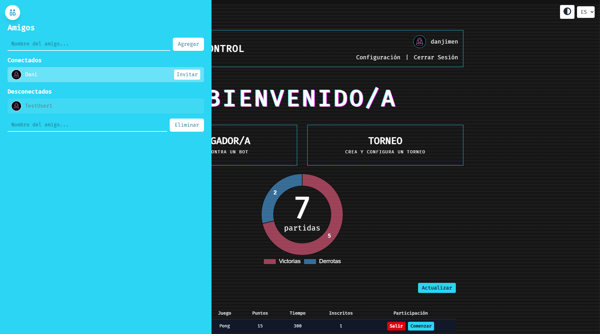
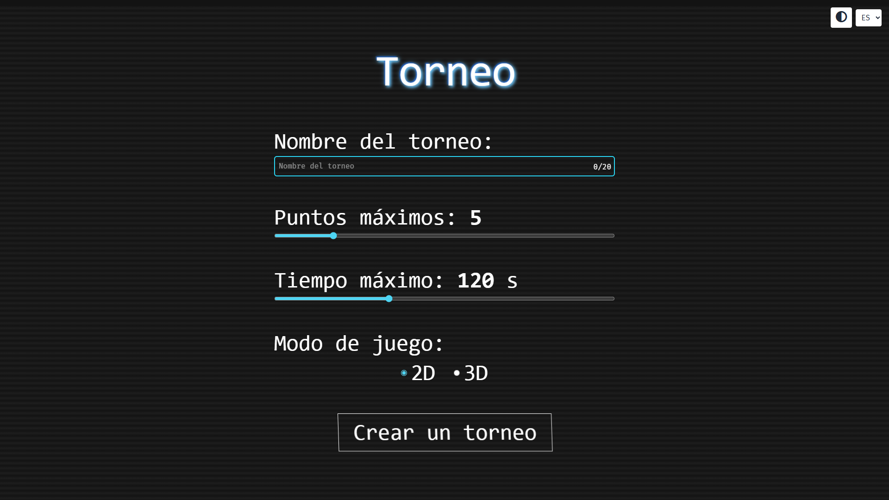

# ft_transcendence

> Proyecto final del **Common Core de 42**. Plataforma web completa de Pong multijugador en tiempo real, con enfoque en arquitectura, experiencia de usuario y sistemas reales.

---

## 🕹️ Visión general del proyecto

**ft_transcendence** es el proyecto final del **Common Core de 42**, planteado como una aplicación web de gran escala inspirada en el clásico **Pong (1972)**.

Más allá de ser un juego, este proyecto demuestra la capacidad de **diseñar, desarrollar y desplegar un sistema full‑stack complejo**, integrando tiempo real, autenticación, multijugador, seguridad y una arquitectura moderna de frontend.

La plataforma permite partidas en tiempo real, torneos, usuarios persistentes, interacción social y un motor de juego autoritativo en servidor, todo ejecutándose dentro de un entorno completamente **dockerizado**.

Este repositorio está pensado no solo como entrega académica, sino como un **proyecto técnico defendible y orientado a entorno profesional**.

---

## 🚀 Funcionalidades

### 🕹️ Gameplay
- Partidas de Pong en tiempo real
- Multijugador local y **remoto**
- Sistema de torneos con matchmaking
- Motor de juego autoritativo en servidor
- Físicas y reglas idénticas para todos los jugadores

### 👤 Usuarios y sistema social
- Registro e inicio de sesión
- Perfiles persistentes con avatar
- Sistema de amigos y estado online
- Historial de partidas y estadísticas
- Invitaciones a jugar en multijugador a tiempo real

### 🎨 Experiencia de usuario (Frontend)
- UI y UX totalmente personalizadas
- Diseño responsive (desktop y mobile)
- Modo oscuro y personalización visual
- Soporte multi‑idioma (3 idiomas)
- Sistema de modales, toasts y popovers
- Navegación accesible y feedback visual constante

### 🧱 Plataforma
- Arquitectura SPA
- APIs REST y WebSocket
- Contenedores Docker
- Flujos de autenticación seguros

---

## 🧩 Módulos implementados

El proyecto alcanza el **100% de completado**, superando el mínimo de **7 módulos mayores** exigidos por el enunciado oficial y los módulos extra para el bonus.

### ✅ Módulos mayores
- **Web – Framework de Backend** (Fastify + Node.js)
- **Gestión estándar de usuarios**
  - Registro / login
  - Perfiles
  - Avatar
  - Amigos
  - Historial de partidas
  - Estadísticas
- **Remote Players** (Multijugador en tiempo real)
- **IA** (Oponente controlado por nuestra propia IA)
- **Pong en servidor + API**
- **Gráficos 3D avanzados** (Babylon.js)

### ✅ Módulos menores
- **Framework y tooling de frontend** (TypeScript + Tailwind)
- **Base de datos** (SQLite)
- **Dashboards de estadísticas de usuario y partidas**
- **Soporte multi‑idioma**
- **Compatibilidad con múltiples navegadores**
- **Diseño responsive** (Compatible con todos los dispositivos)
- **Personalización del juego** (Duración y puntos de la partida, dificultad de la IA, modo 2D/3D, colores)

---

## 🏗️ Tecnologías

### Frontend
- TypeScript
- Arquitectura SPA
- Vite
- Tailwind CSS
- Babylon.js (gráficos 3D)

### Backend
- Node.js
- Fastify
- APIs REST y WebSocket
- OAuth 2.0

### Base de datos
- SQLite

### DevOps y tooling
- Docker y Docker Compose
- Makefile personalizado
- Arranque con un solo comando

---

## 🔐 Seguridad

La seguridad se ha tratado como un **requisito de diseño**, no como un añadido posterior:

- Hashing seguro de contraseñas
- Validación de inputs en cliente y servidor
- Protección frente a XSS e inyecciones
- Autenticación basada en tokens
- Comunicación segura HTTPS / WSS
- Variables de entorno aisladas mediante `.env`

---

## 🐳 Instalación y ejecución

### Requisitos

Antes de ejecutar el proyecto necesitas tener **Docker** y **Docker Compose** instalados.

#### Instalar Docker

- **Linux**: https://docs.docker.com/engine/install/
- **macOS**: https://docs.docker.com/desktop/setup/install/mac-install/
- **Windows**: https://docs.docker.com/desktop/setup/install/windows-install/

Una vez instalado, verifica la instalación:
```bash
docker --version
docker compose version
```

---

### ▶️ Ejecución del proyecto

El proyecto está completamente dockerizado y puede arrancarse usando el **Makefile** (recomendado) o directamente con Docker Compose.

#### Opción recomendada (Makefile)

```bash
make up
```

Este comando:
- Genera certificados HTTPS locales
- Construye las imágenes necesarias
- Levanta todos los servicios

#### Opción alternativa (Docker Compose)

```bash
docker compose up --build
```

Ambas opciones lanzan el mismo entorno.

---

### 🛠️ Comandos disponibles en el Makefile

| Comando | Descripción |
|--------|-------------|
| `make up` | Levanta los contenedores |
| `make up-detached` | Levanta los contenedores en segundo plano |
| `make down` | Detiene los contenedores |
| `make restart` | Reinicia todos los servicios |
| `make logs` | Muestra los logs en tiempo real |
| `make build` | Construye las imágenes Docker |
| `make rebuild` | Reconstruye todo desde cero |
| `make clean` | Limpia contenedores, redes y volúmenes |
| `make fclean` | Limpieza completa (incluye imágenes y base de datos) |
| `make certs` | Regenera certificados HTTPS |
| `make clean-certs` | Elimina certificados locales |
| `make format-front` | Formatea el frontend con Prettier |
| `make format-back` | Formatea el backend con Prettier |

---

### Ejecución del proyecto

El proyecto está completamente dockerizado y puede arrancarse de dos formas.

#### ▶️ Opción recomendada (Makefile)

```bash
make up
```

Este comando se encarga de construir las imágenes y levantar todos los servicios necesarios.

#### ▶️ Opción alternativa (Docker Compose)

```bash
docker compose up --build
```

Ambas opciones lanzan exactamente el mismo entorno.

---

## 📁 Repository Structure (simplified)
```
├── frontend/
├── backend/
├── docker-compose.yml
└── README.md
```

---

## 👥 Desglose de contribuciones

Proyecto desarrollado en equipo, con responsabilidades bien diferenciadas.

### Mi contribución (Frontend & Plataforma)

Fui responsable de **todo el frontend y la infraestructura de la plataforma**, incluyendo:

- Arquitectura completa del frontend (SPA)
- Diseño UI & UX
- Sistema de componentes
- Layout responsive y accesibilidad
- Modo oscuro y personalización visual
- Sistema multi‑idioma (3 idiomas)
- Formularios (registro, login, perfil, cambio de contraseña)
- Gestión de avatar y personalización de usuario
- Dashboards de usuario, historial de partidas e historial de torneos
- Sidebar de amistades e invitaciones a multijugador
- Sistema de modales, toasts y popovers
- Configuración de WebSockets de torneos y de amistades
- Configuración del servidor de desarrollo (Vite)
- Dockerización del proyecto
- Orquestación de contenedores
- Makefile y tooling de desarrollo

En resumen: **todo lo visible y utilizable por el usuario**, excluyendo únicamente el motor del juego y la lógica backend.

### Contribución del equipo
- Arquitectura backend
- APIs y lógica de servidor
- Motor del Pong en servidor
- Sincronización en tiempo real del gameplay

---

## 📸 Capturas de pantalla

### Home


### Registro e inicio de sesión


### Perfil y panel de administración


### Juego 2D y 3D


### Configuración de usuario


### Lista de amigos


### Configuración de partidas/torneos



---

## 🏁 Notas finales

**ft_transcendence** representa el cierre del Common Core de 42:

- Aplicación compleja en tiempo real
- Fuerte enfoque en arquitectura y seguridad
- Separación clara de responsabilidades
- Desarrollo frontend con mentalidad de producto real

Este proyecto refleja mi forma de trabajar:
**arquitectura limpia, experiencia de usuario cuidada y código mantenible**.

> "No va solo de Pong — va de todo lo que hay alrededor." 🚀

